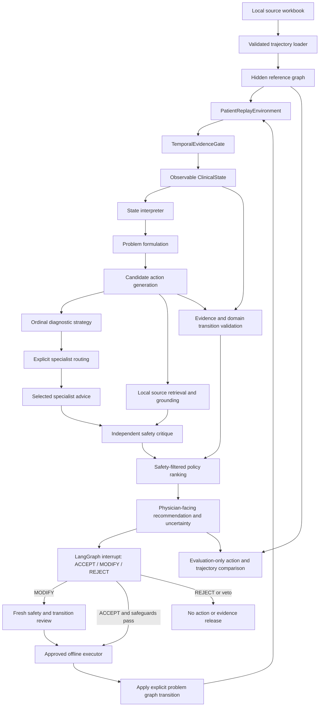
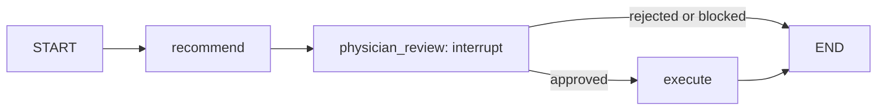

# Clinical decision framework architecture

ClinTraj implements an offline, physician-facing research framework for longitudinal clinical decisions. Its clinical method is represented by validated observations, stable clinical problems, management ownership, candidate actions, and forward decision events. LangGraph supplies checkpointing and the physician interruption lifecycle. The included model is a local workflow fixture; it is not a diagnostic or treatment model, and successful execution does not demonstrate clinical efficacy.

## Data and scientific boundaries

The source workbook contains 400 cases and 3,328 candidate trajectory nodes. Its review columns are empty. Physician annotations are optional for building and exercising the architecture; their absence means clinician correctness, acceptability, and rationale-quality endpoints are unavailable. The framework does not substitute agreement with an unreviewed reference for clinical correctness.

The loader preserves canonical `GoldenNode` and `GoldenEdge` records. A node contains `case_id`, `step_id`, `new_evidence`, `action_type`, `action`, and `clinical_rationale`. An edge contains `parent_step_id`, `child_step_id`, and `relation`. Runtime metadata, model outputs, ownership inferences, and prompt hashes are stored separately. Source problems and image discrepancies are reported in [data_inspection.md](data_inspection.md); the source workbook is never silently amended.

Three representations have distinct purposes:

| Representation | Owner and purpose | Agent visibility |
|---|---|---|
| `ClinicalDecisionGraph` | Loader/evaluator reference DAG, preserving source rows and relation labels | Hidden in full; reference actions and rationales are never prompt inputs |
| `ClinicalState` and `ObservedDecisionGraph` | Current observations, inferred problems, ownership, and already executed clinical events | Current observable projection only |
| LangGraph `WorkflowState` | Execution checkpoint, recommendation, pending physician decision, outcome, and execution ID | Runtime infrastructure; clinical meaning is not inferred from runtime topology |

## Information flow



This diagram describes the full method configuration. Representation and role ablations change the invoked stages. The clinical graph changes only after physician approval. `SafetyCritic` may dry-run `apply_candidate` on an independent snapshot to validate a proposal, but that operation does not modify the patient's current state or unlock evidence.

## Observable state and temporal evidence

`domain/clinical_state.py` defines `ClinicalState`: `case_ref`, integer `clock`, `available_evidence`, active/resolved/suspended problems, the ownership index, differential, uncertainty, risk flags, previous actions, and the observed clinical graph. Validation checks evidence uniqueness, release times, graph references, problem partitions, and ownership consistency. An `Evidence` record carries an ID, text, source, release ordinal, and optional observation ordinal.

`TemporalEvidenceGate` holds complete evidence internally and releases an item only when its availability time has arrived **and** all prerequisite event IDs have completed. `snapshot()` returns a newly validated observable state. Agents receive that state, not the gate, reference graph, or event-completion capability. `complete_event()` is an environment operation and rejects rewinding time. `ClinicalState.require_evidence()`, coordinator reference checks, and safety validation reject references outside the visible evidence set.

The source lacks verified event and release timestamps. `PatientReplayEnvironment` therefore treats source row *n*'s `new_evidence` as visible immediately before decision *n*, and completion of that decision releases the next row. This is an explicit ordinal replay assumption. It does not establish that source narratives are free of hindsight. Evaluation-only `audit_future_leakage()` screens unavailable IDs and exact hidden-text matches; it does not establish paraphrase-level or causal absence of leakage, and its hidden evidence is never fed back to agents.

## Clinical problems and graph transitions

`ClinicalProblemManager` maintains stable problem IDs, lifecycle status, ownership, and append-only decision events. Its public operations are `create_problem`, `update_problem`, `consult`, `suspend_problem`, `resume_problem`, `resolve_problem`, `transfer_ownership`, and `reintegrate_problem`. `into_state()` returns a fully revalidated snapshot.

`apply_candidate(state, candidate)` maps structured action fields to those operations and advances the ordinal clock by one. Candidate fields explicitly identify the target problem, parent problem for a branch, destination specialty for a transfer/consultation, and ancestor reintegration target for a return. The manager enforces semantics rather than accepting free-form relation descriptions. See [clinical_graph_semantics.md](clinical_graph_semantics.md) for exact invariants and examples.

## Agent roles and contracts

`RoleAgent` loads a versioned YAML prompt, sends a provider-neutral `ModelRequest`, and validates the returned JSON against a Pydantic schema with forbidden extra fields. A malformed response fails closed with an error that does not echo clinical text. The coordinator additionally validates evidence IDs, candidate IDs, routed specialties, and retrieved citation IDs.

| Role | Output and scientific function |
|---|---|
| State interpreter | `StateInterpretation`: observation summary, evidence references, uncertainty, and additional explicit risk flags |
| Problem formulation | `ProblemFormulation`: differential, descriptions of existing stable problem IDs, and uncertainty |
| Next action generator | `ActionGeneration`: executable candidates with action/relation enums, rationale, evidence references, graph arguments, and unresolved prerequisites |
| Diagnostic strategy | `StrategyAssessment`: independently prompted ordinal information, benefit, urgency, harm, burden, and delay judgments |
| Selected specialists | `SpecialistAdvice`: advice and concerns for explicitly routed specialties |
| Grounding | `GroundingAssessment`: proposed support using actual retrieved source IDs, with limitations |
| Safety critic | `SafetyReview`: exactly one independent assessment per candidate, including possible vetoes |
| Arbiter explanation | `ArbiterExplanation`: physician-facing explanation of the safety-filtered selection and uncertainty |

The default router uses explicit requested specialties and active problem owners that match the configured specialist pool. It does not run every specialist, infer routing from hidden labels, or treat specialist involvement as ownership transfer. A formulation's specialty suggestion is advisory context for action generation; actual routing requires an explicit candidate specialty or current owner.

The implemented scoring policy is transparent and uncalibrated. LOW/MEDIUM/HIGH are encoded as 0/1/2 in a configurable signed weighted sum; UNKNOWN dimensions are omitted and reported. These numbers are research rubric encodings, not measured clinical utility or predicted outcome probabilities. Missing dimensions can make rankings incomparable. A future `ScoringPolicy` may implement learned or calibrated selection after suitable validation.

Safety exclusions precede ranking. Deterministic checks address evidence provenance, graph validity, declared contraindications/prerequisites, explicit instability and escalation flags, and unassessed invasive actions. A separately prompted model critic can add vetoes. A finding-free response does not certify safety. Specialist advice and retrieved support currently reach the critic and physician explanation; they do not directly produce an additional numeric rescoring pass. The explanatory arbiter cannot overturn a veto or replace the selected ID by majority vote.

`Recommendation` records candidate alternatives, selection, rankings, critiques, source IDs/content hashes, uncertainty, effective risk flags, proposed differential, actual role invocations, prompt versions and hashes, and model metadata. The coordinator limits model calls per proposal using `RuntimeConfig.max_model_calls_per_decision`; exceeding the limit aborts rather than silently dropping a required role. A physician modification may require an additional safety-role call.

## Physician gateway and execution runtime

`ClinicalCoordinator.propose(state)` is framework independent. `review(state, recommendation, decision)` accepts only a structured `PhysicianDecision` carrying ACCEPT, MODIFY, or REJECT, a physician reference, rationale, and the exact recommendation ID. MODIFY requires a complete replacement candidate; other responses forbid one. Approval also binds to a fingerprint of the original clinical state. A decision for an earlier recommendation cannot approve the next step.

Every accepted or modified action receives current deterministic checks. ACCEPT preserves the original independent vetoes. MODIFY receives a fresh model critique when the full critic configuration is active. Risk flags added by interpretation are preserved for modification review. The runtime carries effective risk flags, proposed differential, and uncertainty into the approved execution state; inferred diagnoses remain hypotheses rather than newly observed evidence.

`LangGraphRuntimeAdapter(coordinator, executor)` implements:

```python
paused = runtime.start(observable_state, thread_id="pseudonymous-thread")
result = runtime.resume("pseudonymous-thread", physician_decision)
next_paused = runtime.advance("pseudonymous-thread")  # after successful execution
recovered = runtime.retry_execution("pseudonymous-thread")  # only a failed approved executor
```

The actual execution graph is small:



`InMemorySaver` checkpoints preserve pending review state within the local process. Proposal generation occurs before the interrupt node, so resuming does not regenerate the proposed decision. `advance()` creates a new decision cycle and another required interruption. Duplicate completed resumes do not reexecute. A failed approved executor can be retried with the original execution ID, without another generation pass or inferred approval.

The injected callback has signature `(state, action, execution_id) -> ClinicalState`. For graph-aware retrospective replay use `PatientReplayEnvironment.graph_executor`, which validates/applies domain semantics and combines them with newly released observations. The plain `executor` supports representation ablations without maintaining a clinical problem graph. No bundled callback writes an EHR, places an order, or performs a clinical procedure. Production integration requires authenticated physician identities, access control, secure durable checkpoints, and executor-side durable idempotency for crashes after an external side effect. In-process receipts do not supply those guarantees.

## Replay and evaluation

Strict replay requires both the recorded action type and exact action text to match before the observed continuation is released. Alternative replay additionally requires an evaluator-supplied `AlternativeAction` whose reviewer explicitly licenses that observed continuation. Unsupported actions stop; arbitrary counterfactual patient outcomes are not generated. Source relation labels are preserved separately from the stricter semantics of newly generated runtime events.

The evaluator receives predictions and hidden references outside the agent prompt path. `evaluate_steps()` reports action agreement, available clinical review endpoints, relation detection metrics, safety/reasoning rates when labeled, trajectory completion, and calibration only when suitable confidence and correctness labels exist. Empty clinical labels produce unavailable results, not zero-error claims. Aligned graph edit counts require a supplied step alignment. Case-level splitting and bootstrap helpers avoid treating correlated trajectory steps as independent patients; cross-admission patient grouping still requires additional data.

Experiment YAML files configure six baseline families and role/representation ablations. Temporal-gate removal and physician-gateway removal remain explicitly unsupported protocol declarations in the physician runtime. The executable runner uses a shared synthetic workflow fixture; its agreement results demonstrate wiring and reproducibility, not clinical performance or multi-agent superiority.

## Model and data governance boundary

`ModelAdapter` is a provider-neutral structured JSON interface. `DeterministicMockAdapter` performs no network calls, retains role names instead of patient payloads, and requests conservative physician reassessment. `ExternalJSONAdapter` accepts an injected transport, but requires both `allow_external_calls=True` and `allow_clinical_data_transmission=True` before invoking it. Bundled tests use local synthetic observations and do not send repository cases externally. There is no bundled OpenAI, Gemini, Anthropic, or vLLM network integration.

Pseudonymous case references are removed from model payloads, but evidence text may still contain PHI; removing an identifier does not establish de-identification. Raw state exists in process-memory checkpoints and physician-facing recommendations, so those objects must be treated as sensitive. The runtime rejects explicitly enabled LangSmith/LangChain tracing flags; external tracing is not a default feature. Aggregate experiment manifests record configuration, model metadata, prompt hashes, dataset hashes, environment versions, and available git provenance. Clinical deployment, external model use, and prospective evaluation remain separate work requiring governance and validation.

## Verification evidence

Behavioral tests cover strict message schemas, future evidence rejection, safety vetoes, interpreter risk persistence, graph-invalid proposals, citation provenance, role ablations, model-call budgets, provider consent gates, actual checkpoint interruption/resumption, recommendation-bound approvals, modification/rejection, and execution retries. Source golden tests verify the five actual source graphs; separate conceptual tests exercise the intended clinical structures. The source tests do not retrospectively convert missing annotations into clinical gold labels.
