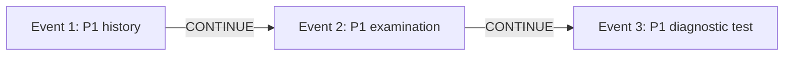
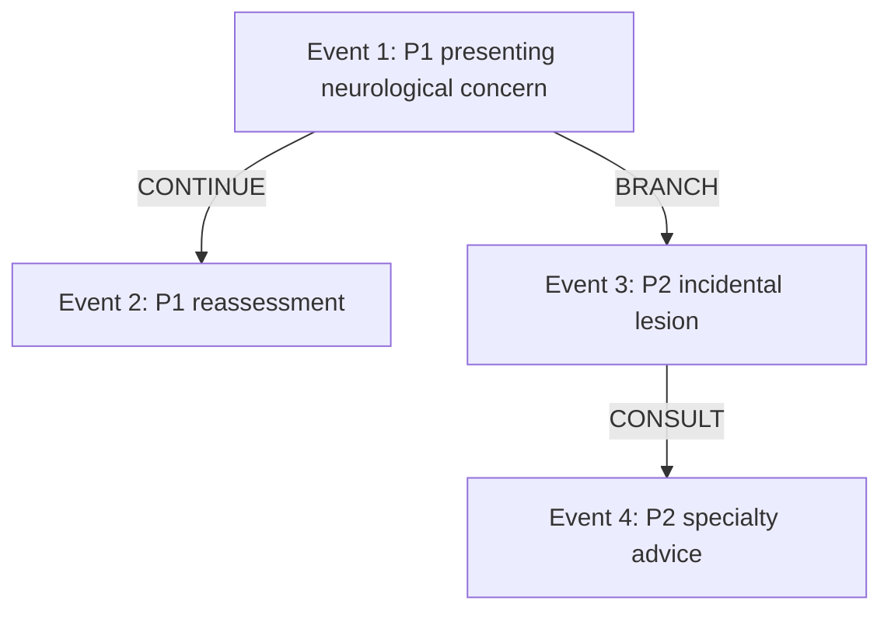
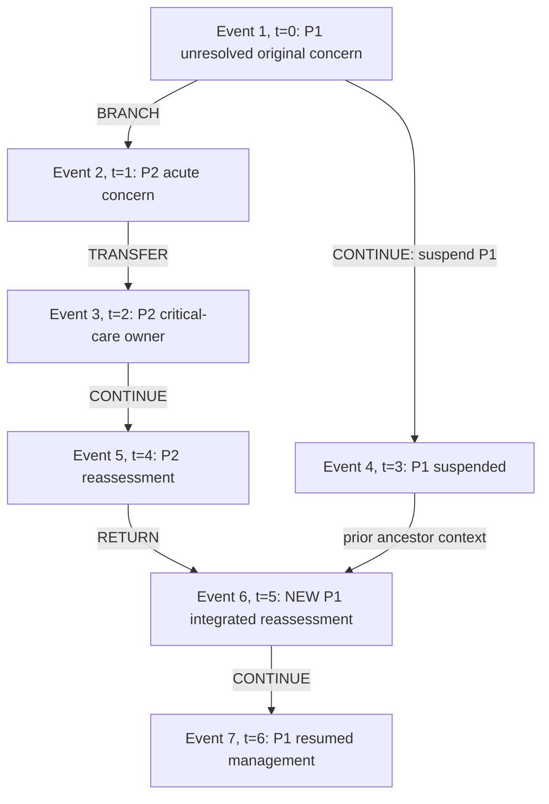

# Clinical graph semantics

The clinical decision graph represents changes in patient-management reasoning over time. It is independent of the LangGraph execution workflow. Actions describe what is proposed or performed; relations describe how the new event connects to a clinical problem and its prior management. The allowed action types are ASK_HISTORY, EXAM, TEST, CONSULT, TRANSFER, TREATMENT, PROCEDURE, PATHOLOGY, REASSESS, and DISCHARGE_FOLLOWUP. The allowed relations are START, CONTINUE, BRANCH, CONSULT, TRANSFER, and RETURN.

## Source records and observed events

`ClinicalDecisionGraph` contains the minimal canonical `GoldenNode`/`GoldenEdge` representation. Validation rejects duplicate nodes or edges, mixed cases, missing parents, orphan nodes, invalid roots, and any non-root edge whose parent step is not earlier than its child. Increasing step IDs enforce a DAG in the current data model. Source edges preserve their supplied relation labels even when the relation appears to describe the preceding action rather than the child action.

`ObservedDecisionGraph` contains only already executed `DecisionEvent` objects. An event has a stable event ID, ordinal clock, problem ID, owner, action type, relation, parent event IDs, evidence references, rationale, and optional advisory specialty. START has no parents. Other events require parents that already exist and have smaller clocks. Duplicate IDs/parents and backward references are invalid. `ClinicalState` additionally checks that event evidence and event times are currently available.

`ClinicalProblemManager` imposes clinical transition rules beyond DAG integrity. It creates events transactionally and advances the episode event clock strictly. Stable `ClinicalProblem` IDs are distinct from event IDs: one problem persists across many actions. An ownership index must exactly match the owners in the active, suspended, and resolved problem records. Problem status is ACTIVE, SUSPENDED, or RESOLVED.

## Relation contracts

| Relation | Meaning | Implemented transition |
|---|---|---|
| START | Introduce a new top-level clinical problem | New problem ID and label; no clinical parent |
| CONTINUE | Advance work on the same active problem | Retain problem ID and owner; append to that problem's latest event |
| BRANCH | Introduce a distinct problem under an active management problem | New ID and distinct label; existing active parent; inherit current parent ownership |
| CONSULT | Obtain specialty advice while retaining management ownership | Existing active problem; explicit specialty; CONSULT action and advisory-specialty record |
| TRANSFER | Change primary ownership of a problem | Existing active problem; different owner; TRANSFER action and ownership-change record |
| RETURN | Reintegrate a branch into an ancestor's current management | New REASSESS event on the ancestor with both source and ancestor event parents |

`CandidateAction` carries the explicit arguments used by `apply_candidate`: `problem_id`, `relation`, `action_type`, `new_problem_label`, `parent_problem_id`, `specialty`, `reintegration_target_id`, `evidence_ids`, and `rationale`. `specialty` names a consulted specialty or transfer destination; a top-level START may also use it as initial owner. A BRANCH inherits the parent owner and does not change ownership merely because a new specialty is mentioned.

Safety validation checks these arguments before physician review by dry-running the domain transition. A valid dry run creates no persistent clinical event. The approved executor performs the transition using a revalidated state.

## CONTINUE: sequential action within one problem

An additional history question, focused examination, or follow-up test can continue the same active problem:



All three events retain P1 and its owner. Changing the test modality does not by itself create a new clinical problem. `update_problem()` rejects an inactive problem and cannot perform ownership transfer. The coordinator requires transfer and consultation candidates to use their explicit structural relations, except that a CONSULT action may initiate a separately justified BRANCH.

## BRANCH: explicit problem decomposition

In a synthetic neurological-presentation scenario, an independently relevant incidental lesion can introduce P2 under P1:



`create_problem("P2", ..., parent_problem_id="P1")` requires P1 to be active, P2 to be new, and the clinical label to differ from P1's label. It records P2's parent problem ID and connects the new event to P1's latest recorded event. The example is schematic: exact parent event IDs depend on actual event order; if P1's reassessment occurs before branch creation, that newer P1 event is the branch parent.

The manager checks identifiers, ownership, hierarchy, and label distinction. It cannot establish from a different label alone that a branch is clinically meaningful. The evidence/rationale and physician decision remain necessary to assess that claim. A useful branch-detection benchmark therefore needs independently reviewed problem definitions; a software-valid branch is not automatically a clinically correct branch.

## CONSULT and TRANSFER are different operations

Consider a synthetic fracture problem managed by a primary team. Specialty advice can precede actual takeover:

| Event | Problem | Action/relation | Owner after event | Advisory specialty |
|---|---|---|---|---|
| 1 | P2 | Existing problem state | primary_team | None |
| 2 | P2 | CONSULT / CONSULT | primary_team | orthopedics |
| 3 | P2 | TRANSFER / TRANSFER | orthopedics | None |

`consult("P2", "orthopedics", ...)` appends advisory work without changing P2's owner. `transfer_ownership("P2", "orthopedics", ...)` records the old/new owners and changes the owner in the new event and problem record. Transferring to the same owner is invalid. Transfer requires an active problem; no independent branch or consultation can implicitly perform this ownership change.

These examples express software semantics, not a recommendation that a particular clinical presentation requires consultation or transfer. The source workbook frequently places CONSULT or TRANSFER relation labels on the action following the corresponding consultation or transfer. The loader retains those records and reports the mismatch instead of forcing them into the runtime convention.

## RETURN creates a new forward integration event

A return connects current branch progress to a new reassessment of an ancestor. It never changes a historical node or sends the graph backward in time. A synthetic acute-care scenario can be represented as:



The integration event E6 has two parents, `(E5, E4)`, both earlier than t=5. Its problem ID and owner are P1's, its action is REASSESS, and its relation is RETURN. The source branch P2 and the ancestor P1 remain distinct problem records. Returning does not itself claim that P2 has resolved, transfer P2's ownership back, or reverse a prior intervention.

`reintegrate_problem("P2", "P1", ...)` requires P1 to be an ancestor of P2. Self-return and return to an unrelated problem are invalid. A suspended source branch cannot return before it is ready; a resolved ancestor cannot be resumed by this operation. An active or resolved source may reintegrate into an active or suspended ancestor. A suspended ancestor becomes active at the new integration event. Cyclic ancestry is rejected.

An executable domain-only example is:

```python
from clintraj.domain.problem_manager import ClinicalProblemManager

manager = ClinicalProblemManager()
manager.create_problem("P1", "Original synthetic concern", "primary_team",
                       clock=0, rationale="Initialize synthetic management problem.")
manager.create_problem("P2", "Acute synthetic concern", "primary_team",
                       clock=1, parent_problem_id="P1",
                       rationale="Independent current concern requires its own pathway.")
manager.transfer_ownership("P2", "critical_care", clock=2,
                           rationale="Synthetic ownership transition.")
manager.suspend_problem("P1", clock=3,
                        rationale="Original concern remains unresolved while acute care proceeds.")
manager.update_problem("P2", clock=4,
                       rationale="Current reassessment supports reintegration in this fixture.")
integration = manager.reintegrate_problem("P2", "P1", clock=5,
                                          rationale="Reassess original concern using current state.")
assert integration.parent_event_ids == ("event-5", "event-4")
assert integration.problem_id == "P1"
assert manager.get("P1").status.value == "ACTIVE"
assert manager.get("P2").owner == "critical_care"
```

This demonstrates manager behavior using synthetic labels. Clinical runtime proposals additionally require appropriate visible evidence, safety screening, and physician approval. No historical pathology or later outcome is assumed to be known at an earlier event.

## Problem lifecycle

The supported explicit lifecycle changes are ACTIVE to SUSPENDED, SUSPENDED to ACTIVE, and ACTIVE to RESOLVED. Each creates a new REASSESS/CONTINUE event rather than editing earlier events. `resolve_problem()` does not imply ownership transfer. The current manager does not reopen resolved problems through `resume_problem()`; a different clinical representation requires an explicit extension and validation. Reintegration can resume a suspended ancestor as described above.

`into_state()` partitions problems by status and regenerates the ownership index from the problem records. `apply_candidate()` reconstructs an episode-local manager, applies one structured candidate at `state.clock + 1`, and returns a newly validated state. Agent suggestions do not mutate shared global problem state.

## Five selected cases and fidelity tests

The five identifiers supplied in the prompt are loaded as source graph integration fixtures. Their original action sequences and relation counts are tested in `tests/golden_cases/test_source_trajectories.py`. The intended schematic structures are exercised separately in `tests/golden_cases/test_conceptual_scenarios.py`:

| Selected case | Source/schematic theme | Interpretation constraint |
|---|---|---|
| Case 1 | Predominantly linear progression including procedure and pathology | The source supports the linear structural pattern |
| Case 2 | Gastrointestinal pathway and ENT advice | Source has no RETURN; the conceptual reintegration is a separate synthetic scenario |
| Case 3 | Pulmonary concern and vertebral-fracture pathway | Consultation and ownership transfer are distinct; source parent alignment is preserved |
| Case 4 | Neurological concern and incidental breast pathway | Synthetic problem decomposition illustrates intended semantics; source labels do not establish stable ownership or ancestry |
| Case 5 | Urologic concern, acute deterioration, critical care, and resumption | Source RETURN edges are forward but do not supply the complete explicit runtime integration model |

Source rows contain one incoming relation each. They cannot directly supply the two-parent integration event shown above. Adding runtime ownership and multi-parent semantics is a method-layer design choice, not a claim that the workbook already contains those annotations. Optional clinical review would support clinical validity assessment and richer reference annotation; it is not required to execute structural tests or build the framework.

## Scope of enforcement

The implementation enforces temporal direction, identifier integrity, evidence-reference visibility, explicit ownership transitions, and a defined reintegration ancestry. It cannot determine whether a clinically plausible label, rationale, branch, or transfer is correct solely from graph structure. Existing software tests establish implementation behavior. Clinical correctness, generalization, benefit, and safety require separately designed empirical evaluation and physician assessment.
