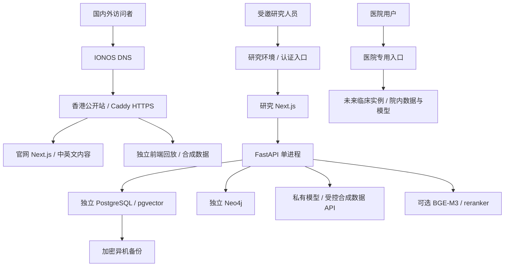

# clintraj.icu 完整部署方案

更新：2026-09-17。面向国内外同样重要的访问需求，覆盖课题组研究、论文、产品、数据介绍、演示与未来产品使用。

本次仅交付方案，没有购买服务器、修改 DNS 或发布服务。下文的待开发配置、预算、工期均为规划，不代表已经实施或通过线上验收。

## 1. 推荐方案

**域名和 DNS 继续留在 IONOS；首期用香港服务器部署公开官网和合成回放；动态研究工作台使用独立受保护环境；真实临床产品另设医院或专用部署。**

域名、DNS、服务器可以分开购买。IONOS 支持将域名解析到外部服务器，不需要为了使用这个域名而购买 IONOS 主机。[IONOS DNS](https://www.ionos.com/help/domains/dns-settings/)

沿用 Linux + Docker Compose + Caddy + Next.js。公开页面不依赖数据库与模型启动，论文和产品介绍可以独立维护。首期不引入 Kubernetes。

香港是国内外访问的折中候选，需要先测线路。建议先短周期租用阿里云香港实例，测试大陆三网及北美/欧洲后再长期购买；必要时比较其他香港线路或新加坡。香港并不保证大陆低延迟，供应商也明确提示境外节点使用国际带宽可能导致较高延迟。[阿里云区域与网络](https://www.alibabacloud.com/help/en/simple-application-server/product-overview/regions-and-network-connectivity)

## 2. 域名与内容结构

| 地址 | 用途 | 访问方式 | 时机 |
|---|---|---|---|
| `clintraj.icu` | 课题组与 ClinTraj 官网 | 公开 | 首期 |
| `www.clintraj.icu` | 永久跳转主域 | 公开 | 首期 |
| `/research`、`/publications` | 研究方向、论文、DOI、代码、引用 | 公开 | 官网建设 |
| `/products` | 产品介绍、界面与实际验证状态 | 公开 | 官网建设 |
| `/datasets` | 数据规模、字典、版本、许可和申请入口 | 公开元数据 | 官网建设 |
| `/team`、`/contact` | 经确认的成员介绍和联系方式 | 公开 | 官网建设 |
| `demo.clintraj.icu/demo` | 当前合成轨迹回放 | 公开，无模型调用 | 首期 |
| `sandbox.clintraj.icu/workspace` | 真正调用模型的研究演示 | 邀请制，仅合成数据 | 第二阶段 |
| `sandbox.clintraj.icu/observation` | 内部规则、研究观察与审计 | 授权研究人员 | 第二阶段 |
| `staging.clintraj.icu` | 上线前验收 | 认证保护，独立数据与密钥 | 第二阶段 |
| `app.clintraj.icu` | 未来正式产品 | 登录、角色与机构隔离 | 先保留名称，不解析 |

官网和公开回放可以同机。子域方便迁移，但子域本身不隔离数据，仍需独立服务、数据库、凭据和权限。

官网建议提供 `/zh`、`/en` 中英文版本，配置论文稳定链接、站点地图、canonical/hreflang、分享图片、联系邮箱和隐私说明。内容先用 Git 管理的 Markdown/MDX，不必首期维护 CMS。

论文只展示已核验的发表与实验状态。大附件放对象存储或论文归档服务；网站保留版本、许可、DOI 和 SHA-256。数据介绍不等于原始数据公开：授权数据放私有存储，审批后通过限时链接提供，不进入 Git、前端 bundle 或公开 `public/`。

## 3. 当前仓库的部署现状

| 已有实现 | 部署含义 |
|---|---|
| `web/app/page.tsx` 把 `/` 转到 `/workspace` | 尚无课题组首页；需新增，或首期由网关临时跳转回放 |
| `/demo` 使用 `web/data/demo/` 和 `MockTraceEventSource` | 是合成数据前端回放，无需 Python、数据库或模型 |
| Next.js `output: standalone` 和 `web/Dockerfile` | 可复用容器构建；新增 `public/` 资产后须复制到运行镜像 |
| `/workspace`、`/observation`、`/api/*` | 依赖真实后端，不能按静态页面处理 |
| PostgreSQL/pgvector、Neo4j、Ollama、可选 BGE-M3/reranker | 动态演示需要独立计算与存储预算 |
| Caddy 与 production Compose | 已有单域 HTTPS、共享 Basic Auth 和代理骨架 |
| 后端为单用户服务，`/api/sessions` 列出最近会话 | 没有用户/会话所有权隔离；Origin 校验不是认证 |
| 后端启动恢复逻辑按一个进程设计 | 首期不可直接加 workers 或副本扩容 |

Next.js 官方建议自托管时使用反向代理，当前 Caddy 路线可以继续沿用。[Next.js 自托管](https://nextjs.org/docs/app/guides/self-hosting)

上线前需要解决的具体问题：

1. 当前 Basic Auth 保护整个域名，会挡住公开官网；需要按域名划分公开与研究入口。
2. Compose 固定了 PostgreSQL/Neo4j 本地默认口令及 `DATABASE_URL`，只改 `.env` 不够。必须同步修改数据库、init、backend 的配置。已有卷修改环境变量不会自动轮换库内口令；新研究环境建议用全新空库。
3. init/backend 将整仓库挂到 `/source`，seed 发现工作簿便导入。公网配置应删除这一挂载，只挂明确允许的公开资源，并使工作簿路径不存在。`.dockerignore` 无法保护运行时 bind mount。
4. frontend 默认依赖 backend 健康；公开站需要独立 Compose，而非启动完整栈。
5. 除 Caddy 外，需补服务重启策略、资源限额、日志轮转、备份调度与权限。
6. `ALLOW_EXTERNAL_CLINICAL_DATA=false` 只限制外部临床数据调用，不禁止在本地模型会话里输入真实病例。动态演示还需服务端限制会话与输入。
7. Next.js API 代理目前只转发少量请求头；未来认证需设计可信身份传递，不能假定 cookie/Authorization 已传给后端。

## 4. 目标架构



### 阶段 A：公开当前页面

- 建议香港 **2 vCPU / 4 GB RAM / 60–80 GB SSD**，固定公网 IPv4，仅运行公开官网与前端回放。优先在 CI 构建镜像，避免小主机承受构建内存峰值。
- `demo.clintraj.icu/` 转到 `/demo`；官网完成前，根域可临时跳转该演示，完成后改为正式首页。
- 新增仅含 Caddy + 前端的独立公开 Compose，不挂临床数据、不注入后端密钥、不连接研究容器网络。
- 首版可复用前端镜像，但网关只放行 `/demo`、`/demo/*`、`/_next/static/*` 与所需图标；其余默认拒绝。官网完成后逐项扩展路由。长期拆成独立公开构建目标，避免把研究 UI 一起分发。
- 公开域必须拒绝 `/workspace`、`/observation`、`/api` 及 `/api/*`；后端端口不可公网访问。隐藏导航不是访问控制。
- 保留“合成数据回放、模拟医生操作”标签，官网区分“查看回放”和“申请交互试用”。

此阶段即可提供论文、课题申请和产品沟通链接，无需购买推理 GPU。

### 阶段 B：动态研究演示

- 另设研究实例，轻量本地模型起步参考 **8 vCPU / 16 GB RAM / 160–200 GB SSD**。CPU 推理不承诺速度或多人并发。
- 本地模型、BGE-M3 和 reranker 同机时按 **32 GB 或以上**规划，以峰值实测为准；必要时独立部署模型/检索服务器。
- 最初仅向同一可信研究小组开放，共享密码作为过渡；明确告知会话互相可见。不同外部试用者用独立实例，或完成应用权限后再共享服务。
- 动态开放试用前补身份、会话所有权、限流、运行并发上限、每日额度和清理策略。初始可限制一个模型任务运行，超限明确排队或拒绝，不能无限积压后台任务。
- 推荐固定合成病例选择，由后端拒绝非合成会话；不向匿名用户开放自由文本。仅勾选 `synthetic=true` 不能证明内容是合成数据。
- 如使用 DeepSeek，仅发送允许的合成内容，保留外部临床数据禁用和远程 tracing 关闭，密钥仅存后端。还需修改 Compose，不能只改 provider 就认为 Ollama/model-init 不再启动。
- `/api/*`、SSE、研究页面全部禁用 CDN 缓存。浏览器同源调用 Next.js，再走内部 backend，初期不需要独立 API 域名。
- BGE 未准备好时如实显示降级；完整研究评测等索引和预热完成后再进行。

### 阶段 C：实际产品

保留 `app.clintraj.icu` 为品牌入口。真实临床实例可以使用院内域名、VPN 或医院确认的专用接入；统一品牌不要求共享数据库、云服务器或跨境传送患者数据。

正式接入前建设 OIDC/SSO、MFA、角色、机构与会话隔离、服务端授权、导出/删除审计、留存策略、密钥管理、医院接口与恢复能力。认证 cookie 限定产品主机，不设为整个 `.clintraj.icu` 共享。

将进程内后台任务演进为持久任务机制，加入分布式并发控制、幂等与恢复测试后，再评估多副本。临床在线与研究训练分配独立计算资源。

继续保持：内部规则在 `/observation`，不压掉三条候选；医生决定保持权威；时间可见性与会话完整性不变；生成证据有 synthetic 标识及 provenance，且只进入合成研究会话。

## 5. IONOS DNS 与 HTTPS 操作

2026-09-17 本机只读查询显示：权威 NS 为 IONOS `ui-dns` 系列；根域 A=`74.208.236.204`、AAAA=`2607:f1c0:100f:f000::200`，A/AAAA TTL=3600 秒。这只说明已有解析，不能证明 ClinTraj 上线；执行前重新查询。

1. 保存现有 DNS，尤其 MX、SPF/DKIM/DMARC 等 TXT、CAA 和 DNSSEC 状态。
2. 服务器与网关准备好后，在 IONOS → Domains & SSL → `clintraj.icu` → DNS 编辑。
3. 如支持，提前将待改记录 TTL 降到 300–600 秒，等待至少旧 TTL 再切换。生效取决于缓存，不承诺立刻全球生效。
4. 按下表设置；值不带协议、路径或端口。

| 类型 | 主机名 | 值 | 时机 |
|---|---|---|---|
| A | `@` | 公开站公网 IPv4 | 首期 |
| CNAME | `www` | `clintraj.icu` | 首期；网关另做跳转 |
| A | `demo` | 公开站公网 IPv4 | 首期 |
| A | `sandbox` | 研究实例公网 IPv4 | 研究环境就绪后 |
| A | `staging` | 验收实例公网 IPv4 | 验收入口就绪后 |
| AAAA | 启用 IPv6 的主机名 | 已验证可达的服务器 IPv6 | 按需 |
| 不添加 | `app` | 暂不解析 | 产品就绪后 |

**如果新服务器没有可用 IPv6，删除/替换根域现有旧 AAAA；只改 A 会让部分访客仍访问旧地址。** 处理所改主机名的冲突记录/停放绑定，不改邮件记录。CNAME 不与同名其他普通记录共存，也不会自动执行网页跳转。[IONOS A/AAAA](https://www.ionos.co.uk/help/domains/configuring-your-ip-address/changing-a-domains-ipv4ipv6-address-aaaaa-record/)、[子域 CNAME](https://www.ionos.com/help/domains/configuring-cname-records-for-subdomains/configuring-a-cname-record-for-a-subdomain/)

Caddy 给启用域名签发/续期 HTTPS，持久保存证书目录，无需另购商业 SSL。开放 TCP 80/443，确认域名指向入口；若已有 CAA，核实允许所用 CA。www 也需要证书才能 HTTPS 跳转，首期无需通配符证书。[Caddy 自动 HTTPS](https://caddyserver.com/docs/automatic-https)

以下为公开回放网关**草案**；`public-web` 是待新增独立 Compose 的服务名，不是现有配置，可用于实施时参考：

```caddyfile
www.clintraj.icu {
    redir https://clintraj.icu{uri} permanent
}

# 官网完成后替换此临时跳转。
clintraj.icu {
    redir https://demo.clintraj.icu/demo 302
}

demo.clintraj.icu {
    encode zstd gzip
    header {
        X-Content-Type-Options nosniff
        Referrer-Policy same-origin
    }
    redir / /demo 302
    @public path /demo /demo/* /_next/static/* /icon.svg /favicon.ico
    handle @public {
        reverse_proxy public-web:3000
    }
    handle {
        respond "Not found" 404
    }
}
```

实施时验证图标、字体、RSC 导航及所有资源请求，逐项扩展白名单。公开容器本身不连接研究后端。研究入口另设认证和 SSE 代理；Caddy 支持事件流即时转发，端到端仍要验证。[Caddy 反向代理](https://caddyserver.com/docs/caddyfile/directives/reverse_proxy)

## 6. 国内外访问优化

字体、图标、核心脚本和公开附件随站点或自有资源域提供，避免关键页面依赖第三方脚本、境外视频嵌入或 GitHub 原始文件实时加载。当前 Geist 来自项目依赖，部署时检查实际资源请求即可。

测试大陆电信/联通/移动与至少北美、欧洲网络，记录 HTTPS 成功率、首屏、资源失败与 SSE 连续性。ping 不能代替页面验证。建议目标为主要网络无阻断性资源失败，约定条件下官网 p75 LCP 争取 ≤2.5 秒；这是验收目标，需说明地点、设备与样本量，并非速度保证。

流量增长后先缓存公开静态资产，再比较 CDN 与直连。普通全球 CDN 不等于大陆节点。Cloudflare 中国网络是 Enterprise 的独立订阅，要求有效 ICP 备案/许可，不能把普通套餐当成大陆加速方案。[Cloudflare 中国网络](https://developers.cloudflare.com/china-network/)

若以后使用大陆服务器/CDN，按接入商要求办理备案并核实主体、域名实名、后缀及注册商资格。当前 IONOS 域名不能假定改 DNS 即具备备案条件，可能需要转入合规境内注册商或启用完成备案的备用域名。阿里云文档明确区分国际站域名与中国站备案资格。[域名限制](https://www.alibabacloud.com/help/en/dws/product-overview/limits)、[备案流程](https://www.alibabacloud.com/help/en/icp-filing/basic-icp-service/user-guide/icp-filing-application-overview)

未来双区域优先复制公开内容和发布资产。临床会话、私有研究库不因网站加速自动跨区域同步，数据地域另由医院要求决定。

## 7. 主机与代码改造清单

- 使用 Ubuntu 24.04 LTS 或供应商支持的稳定 LTS，依官方步骤安装 Docker Engine/Compose。当前可选 `env_file` 语法要求 Compose v2.24+。[Docker 安装文档](https://docs.docker.com/engine/install/ubuntu/)
- SSH 用密钥，并限制管理员来源/VPN。对外仅开放 80/443；数据库、Neo4j Browser、Ollama、检索和内部 API 不映射到公网。
- 同时检查云防火墙与 Docker 发布端口。不能只设 UFW 就假定容器端口得到保护，Docker 官方文档提示了这一兼容问题。
- 按镜像能力使用非 root 用户，配置资源限额、日志轮转与服务重启；init 一次性任务不要无限重启。
- 密钥放服务器受限文件或密钥管理器，不在 Git/CI 日志公开密码、token、哈希。GitHub 部署凭据最小权限。
- 只发布干净 Git checkout/镜像，不上传开发目录、患者工作簿、`.env`、会话导出或 `outputs/` 整包。

| 待修改/新增位置 | 工作 |
|---|---|
| `web/app/page.tsx` 及官网路由 | 首页、中英文、研究/论文/产品/数据页面 |
| `web/Dockerfile` | 新 public 资产复制与非 root 运行 |
| `deploy/compose.public.yml`（待新增） | 独立公开站，无 backend 依赖与临床网络 |
| `deploy/Caddyfile.public`（待新增） | 根域/www/demo、路由白名单、HTTPS |
| 独立研究 Compose | 参数化口令、去整仓库挂载、独立卷/网络、重启/日志 |
| 后端与 Next.js API 代理 | 身份、会话授权、输入约束、额度、可信身份传递 |
| `.github/workflows/`（待新增） | 检查、不可变镜像、部署与回滚 |
| 备份/恢复脚本与手册 | 加密异机备份、保留时间、恢复与告警 |

发布流程：

1. 变更运行相关检查。前端改动运行 type-check、lint、现有测试和 build；后端改动运行相关测试，涉及会话/数据库时加对应集成检查。
2. 构建带 Git SHA 的镜像，记录摘要，生产拉取同一产物。固定经验证的依赖和镜像，避免自动追随 `latest`。
3. staging 用合成数据验收；生产密钥不进入 staging。发布前备份数据库，确认迁移兼容性。
4. 执行一次受控迁移再切换服务。公开无状态站可双容器轮换；当前单进程动态后台按维护窗口发布，停止新任务并妥善结束运行，不宣称无损多副本切换。
5. 记录 Git SHA、镜像摘要、迁移版本、模型、知识源版本、发布时间和验收结果。
6. 失败退回上一镜像；若 schema 不兼容，按已验证的恢复/迁移方案处理。不要直接让旧镜像写新 schema，也不要用 `docker compose down -v` 做日常回滚。

## 8. 备份与运维

| 项目 | 初始方案 |
|---|---|
| 官网 | Git + 发布镜像；公开资产独立保存 |
| PostgreSQL | 每日逻辑备份，异机加密保存，覆盖会话、检查点和来源元数据 |
| Neo4j | 按版本/版本类型支持的方法做一致备份；Community 初期安排停写/停库 dump |
| 两库一致性 | 同一维护窗口停写，记录共同版本；不复制运行中目录冒充备份 |
| 配置与证书 | Caddy 数据、配置与必要密钥单独加密备份 |
| 保留 | 初始每日 7 份、每周 4 份、每月 3 份，按授权与数据量调整 |
| 恢复目标 | 研究演示暂定 RPO ≤24 小时、RTO ≤4 小时，演练后才能承诺 |
| 监控 | HTTP/HTTPS、证书到期、磁盘/内存、5xx、容器退出、备份失败、模型超时和费用 |

RPO 是可接受数据丢失窗口，RTO 是恢复时间。云快照不能代替数据库一致备份，同机备份不能应对整机丢失。首发至少在空环境恢复一次，之后每月抽查。

研究页面与 trace 不进入 CDN/分析平台缓存。日志以请求 ID、状态码、耗时为主，不记录病例正文、密钥、cookie 或完整会话。研究/产品页面不使用录屏式访问分析。noindex/robots 不替代认证。

## 9. 预算与时间

以下为人民币月度预算预留，**不是供应商实时报价**。不含域名续费、税费、人工或医院硬件；实际费用取决于线路、带宽、合同和活动期限。

| 方案 | 资源 | 月度预留 |
|---|---|---:|
| 官网 + 合成回放 | 香港 2 核 4 GB、60–80 GB SSD、基础流量 | ¥150–450 |
| 小规模资产/异机备份 | 对象存储、备份与流量 | ¥30–150 |
| 动态研究环境（新增） | 香港约 8 核 16 GB、160–200 GB SSD | ¥400–1,500 |
| 完整模型/检索（替代上一行） | 约 8 核 32 GB 或更高 | ¥800–2,500+ |
| 可选云模型 | 合成数据，设置硬额度 | 初始上限 ¥100–500 |

**首期公开站约按 ¥180–600/月准备；需要完整工作台再增加研究实例预算。** 不必让所有官网访客进入实时推理服务。

采购检查正常续费、承诺期限、退订、公网 IP、快照费、包含流量和超额出站费。[阿里云价格入口](https://www.alibabacloud.com/en/product/swas/pricing)；若选 IONOS VPS，按所在地区和订单核对活动期及续费，不以首月广告价做全年预算。[IONOS VPS](https://www.ionos.com/servers/vps)

| 里程碑 | 工期估计（权限和资源具备后） | 交付 |
|---|---|---|
| 当前公开回放 | 1–2 个工作日 | demo HTTPS、路由隔离、国内外首轮验证 |
| 官网内容 | 再 3–5 个工作日，取决于文案 | 首页、研究、论文、产品、数据、联系、中英文框架 |
| 同组邀请试用 | 再 3–7 个工作日，模型/索引准备可能另计 | 合成动态链路、门禁、额度和备份恢复 |
| 不同外部用户共享试用 | 另行估计 | 应用身份、会话隔离与越权测试 |
| 临床产品 | 独立立项 | 医院身份、接口、数据管理和临床验收 |

## 10. 验收与执行所需信息

公开站验收：

- [ ] 根域/www/demo 跳转与深链接刷新正确；证书有效且持久化。
- [ ] A/AAAA 都正确，原邮件解析保持正常。
- [ ] 桌面/手机可读、静态资源无错误、核心资源不依赖不可达外站。
- [ ] 公开域及源站 IP 均不能绕过网关访问研究页面、API 和内部端口。
- [ ] 合成标签保留；发布产物没有患者数据、私有会话、密钥或 trace。
- [ ] 大陆三网及海外检测完成，费用/流量告警配置。

动态环境追加：

- [ ] 合成会话完整走通三候选、多选、自定义决定、证据推进与刷新恢复。
- [ ] SSE 连续/重连、时间可见性、幂等和重启恢复符合项目语义。
- [ ] 规则只在 `/observation`；生成证据仅进入合成会话且有 provenance。
- [ ] 同组共享模式明确告知；多用户模式验证跨用户会话及事件接口被拒绝。
- [ ] 默认数据库口令已替换，单进程运行，空环境恢复成功。
- [ ] 页面如实展示模型/检索就绪与降级，健康检查不冒充完整能力可用。

实施前还需确定云账户与预算上限、首期是否同步开放动态工作台、服务器固定 IP/SSH 授权、IONOS DNS 权限，以及可公开的课题组、论文和数据文案。密码/API key 通过服务端密钥配置，不写进仓库或聊天。

## 附：现有本地流程

以下是本地研究命令，不是本方案的公开站上线命令：

```bash
docker compose up -d --build
# http://localhost:3000/workspace
# http://localhost:3000/observation
# http://localhost:3000/demo
```

完整研究栈按需启动：

```bash
docker compose --profile research up -d --build retrieval
docker compose exec backend python -m clintraj.server.reindex_m3
```

索引可续传，首次下载/预热不计入交互性能；运行前说明预计时间与资源，未就绪时标明降级。公开回放无需运行这类验证。

`scripts/smoke_session.py --url ...` 支持合成 HTTP/model/SSE 验证，但当前没有 Basic Auth 参数。可先在服务器 loopback 验证应用，再使用认证浏览器验收公网代理，不要直接请求受保护公网地址后误判故障。
