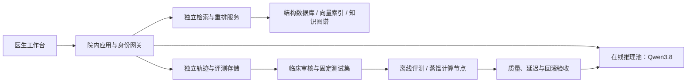

# ClinTraj 院内部署临床智能体平台：产品与预算立项建议

面向院长及医院信息化、医务、科研管理部门。编制日期：2026-09-16。周期：12 个月；范围：单院，首期全科分诊及慢阻肺、肺炎、肿瘤三个专科。金额单位：人民币万元。

## 立项建议

建议设置 **首年项目预算上限 350 万元，先释放 60 万元用于三个月试点**，其余经阶段验收后投入。建设目标是形成医院可掌握的本地模型服务、带出处的医学知识体系、医生决策辅助产品和可重复的智能体评测与蒸馏能力。

平台每一步提供三个可比较的建议，医生可以接受一个或多个、全部拒绝或自主输入。主分诊按患者状态调用专科，建议附当前患者证据与文献来源；观察台保存任务执行、检索、规则发现及医生反馈。首期在研究和辅助工作流中运行，不自动下达医嘱。

预期价值按数据验收：减少医生检索和整理资料的耗时，提高建议依据的可追溯性，形成可扩展的专科知识资产，积累可独立评价的真实使用轨迹。立项不预先承诺诊断准确率提升、收入增长或论文录用。

## 一、项目交付范围

| 建设内容 | 首年交付 |
|---|---|
| 医生产品 | 全中文工作台、三个候选、单选/多选/自填、证据引用、连续患者轨迹 |
| 专科能力 | 全科主分诊 + 慢阻肺、肺炎、肿瘤；按需调用与可配置注册表 |
| 本地模型平台 | Qwen3.8 主模型服务、轻量任务模型、模型版本与灰度回滚 |
| 医学数据平台 | 公共知识、院内历史资料、当前患者证据分域管理；来源版本与授权记录 |
| 观察和评测 | LangGraph 执行事件、医生选择、检索分数、延迟和降级统计；可回放测试集 |
| 蒸馏能力 | 医生审核后的教师数据、学生模型、质量/速度对照报告与上线门槛 |
| 医院集成 | 首期病历、检验、检查报告接口；统一身份、角色权限、日志与运维交接 |

当前代码已有产品原型和研究流程，医院身份体系、正式接口、容量与临床效果验证属于本次拟投入的建设工作。原始 CT 像素诊断、自动医嘱执行、多院区容灾和医疗器械注册不包含在本期报价范围；如纳入则单独核算。

## 二、本地 Qwen3.8 的配置依据

官方已发布可本地部署的 **Qwen3.8-27B** 权重，并给出 vLLM、SGLang 等部署方式。本项目以 27B 作为首期主模型和离线教师模型，后续可替换更强版本，采购合同须锁定具体模型、权重精度、上下文和并发条件。[官方模型卡](https://huggingface.co/Qwen/Qwen3.8-27B)

显存估算必须包括权重、运行开销和并发缓存：27B 权重按 BF16 粗算约 54 GB，8-bit 约 27 GB，4-bit 约 13.5 GB，以上均未计量化元数据、视觉编码器和缓存。因此，单卡能装下量化模型不代表达到低延迟并发指标。

Qwen3.8 另有 **2.4T-A95B** 版本；其权重应按总参数规模估算，4-bit 仅权重理论量级就约 1.2 TB，不能按激活参数量购买显存。本预算以 27B 为边界，旗舰模型的院内集群需另行立项。[官方旗舰模型卡](https://huggingface.co/Qwen/Qwen3.8-2.4T-A95B)

建议在线模型采用经过本院质量评测的量化配置；保留 BF16 基线用于离线比较。复杂病例使用主模型，分诊、结构化、模拟和低风险格式整理逐步交给蒸馏后的轻量模型。专科智能体可以共享同一模型服务，通过角色和知识视图区分，无须为每个专科常驻一份大模型。

## 三、基础设施与低延迟设计

**在线与离线资源隔离是低延迟的核心投入。** 批量知识编码、教师采样、轨迹回放和蒸馏训练放在离线节点，不能挤占医生实时推理资源。此前本地原型测试已出现建索引负载下的检索超时，因此生产规划必须包含这种隔离。

建议配置：

- 在线池：两台 GPU 服务器，各配置 4 张 48 GB 级加速卡或经实测等效配置，主机内存约 512 GB、企业 NVMe。48 GB 容量参照 L40S 官方规格；品牌、供货和替代卡由医院合规采购确定。GPU 数量不是吞吐承诺。[NVIDIA L40S 规格](https://www.nvidia.com/en-in/data-center/l40s/)
- 离线池：一台约 4 × 80 GB 级加速卡服务器或等效可调度院内集群，承担 27B 教师生成及轻量学生 LoRA/QLoRA 蒸馏。预算不支持 2.4T 全参数训练，也不承诺 27B 全参数训练。
- 数据库：两台高内存节点，约 512 GB RAM/台，企业 NVMe、数据库复制与备份。应用可双实例；图数据库自动故障切换涉及具体版本/授权，应在采购中明确，不能把双服务器等同于所有组件已经高可用。
- 存储：首期约 20 TB 可用主存储 + 20 TB 独立备份，保留扩容槽位。影像优先引用院内 PACS，不因建设知识库复制全院影像。
- 网络：数据库与应用采用 25 GbE 级网络；训练节点互联规格按实际并行训练需要报价。长上下文、GPU 通信和量化内核必须参与验收。

推理服务使用已验证支持目标权重的 vLLM/SGLang 版本，启用合适的批处理、结构化输出、请求队列和前缀缓存。前缀缓存主要减少重复输入处理，不会消除新输出的生成时间；患者缓存按权限和会话隔离。[vLLM 前缀缓存说明](https://docs.vllm.ai/en/latest/features/automatic_prefix_caching/)

在线首期限制常用上下文为 8K–16K tokens，完整历史按问题和时间检索。分诊与证据准备合并可合并的调用，被选专科并行执行；慢速审计异步运行。Qwen3.8 推理深度和量化设置须通过质量/速度成对试验确定，不能只靠降低推理深度宣称提速。[Qwen 官方部署说明](https://github.com/QwenLM/Qwen3.8)

## 四、大规模数据库的建设口径

第一阶段以 **100 万可追溯知识片段、10 万级经授权历史结构化记录**作为容量测试规模；架构扩展目标为 1,000 万片段。这里是规划规模，不是当前已有数据，也不要求为凑数量导入低质量资料。

1,000 万条 1024 维 FP32 向量本体约 40.96 GB；还要另外计入图索引、稀疏权重、原文、HNSW、版本和副本。不能用向量本体大小代表数据库总容量。初期沿用 PostgreSQL/pgvector 与 Neo4j；扩容前实测 p95，再决定是否增加专用稀疏/向量引擎。

资料建设顺序为：授权与版本清单 → 去重与文档切分 → 术语映射 → 有条件的医学断言 → 专科维度标注 → 独立检索评测。优先完善三专科的高质量指南、共识、药品资料和医院路径。数据授权费用不等于购买患者数据。

## 五、建议写入验收书的指标

以下均为拟定目标，需在首期实测后锁定；当前原型尚未证明达到这些指标。

| 指标 | 建议首期目标与口径 |
|---|---|
| 负载条件 | 10 个并发临床请求；每请求输入不超过 8K tokens、总输出不超过 1,000 tokens；同一版本语料，记录冷/热缓存 |
| 首个可见反馈 | p95 ≤ 2 秒；单列首个候选内容时间，不能用加载动画代替 |
| 完整三候选 | 正常模型生成 p50 ≤ 8 秒、p95 ≤ 15 秒；必须包括路由、检索、模型输出与传输 |
| 候选可用性 | 30 秒内三候选覆盖率 ≥ 99%；备用补齐单列，模型完整生成率目标 ≥ 95% |
| 检索 | 100 万片段规模下，召回 + rerank p95 ≤ 2 秒，明确候选池和检索质量 |
| 扩容条件 | 20 并发及 1,000 万片段另做容量验收，不沿用 10 并发结果 |
| 可追溯性 | 所有展示的引用可定位原文/版本；医生决策与节点记录完整；重复提交不重复执行 |
| 临床质量 | 在独立盲评集报告 Top-3 可接受率、严重错误率、全部拒绝率，不能以模型自评代替 |
| 可用性 | 试点月可用性目标 ≥ 99.5%，明确维护窗口、故障恢复和各组件边界 |

延迟报告必须覆盖失败和降级比例，不能剔除慢请求后计算。硬件采购以医院脱敏或合成负载的实测验收为条件，不采用供应商通用聊天示例作为最终性能依据。

## 六、轨迹评测与模型蒸馏

首年拟建设约 2,000 个医生审核的决策节点，覆盖正确接受、部分接受、拒绝、自填、证据不足、跨科会诊、分支/转科/回归等场景。病例按患者和时间划分训练、验证、测试集合，测试集不得进入蒸馏数据。

轨迹记录包含当前可见状态、候选、检索引用、工具和路由事件、医生选择、下一时点实际观察及各阶段耗时。评测同时观察单步建议和多步路径：是否使用未来证据、是否误用历史患者结果、是否重复无效检查、是否遗漏问题、图关系是否一致、最终是否收敛到合理处置。保存可核查的简洁理由，不以采集模型隐藏思维链为交付目标。

蒸馏流程：院内 Qwen3.8 教师生成 → 医生审核及错误标签 → SFT 学习结构和选择 → 对可靠偏好样本进行偏好优化 → 学生模型独立盲评 → 量化与速度评测 → 灰度上线。学生先考虑兼容的 4B–9B 级开放模型，具体版本在采购和训练前确认；不虚构尚未核实的 Qwen3.8 小型号。

医生拒绝不自动等于方案错误，须区分患者偏好、资源约束、已有信息和医学错误。模拟证据只能用于流程压力与回放，不能作为证明模型有效的临床结局。

拟定蒸馏门槛：同硬件负载下三候选 p95 延迟下降至少 30%；质量主要终点非劣效界值暂定 3 个百分点，具体样本量由试点结果和统计设计确定；严重错误需单独审查。未达到门槛的学生仅用于分诊或格式处理，不替代主决策模型。

## 七、首年预算建议

**下表是立项分配建议，按含税预算口径预留，并非实时市场报价。** 尚未询价，单项可有较大波动；由医院按适用采购流程取得可比较的正式报价，确认供货、保修、授权与税费。若报价超出总额，先缩减一期范围或复用现有资源，不以降低质量验收门槛补缺口。

| 项目 | 预算口径 | 金额 |
|---|---|---:|
| 在线 GPU 服务 | 2 台 × 35 万；约 4 × 48 GB 级/台，含主机与维保预算 | 70 |
| 离线评测/蒸馏计算 | 1 套 × 80 万；约 4 × 80 GB 级或等效院内资源 | 80 |
| 数据库服务器 | 2 台 × 9 万，高内存、企业 NVMe | 18 |
| 主存储和独立备份 | 初期各约 20 TB 可用容量及扩容能力 | 22 |
| 网络、接入安全与 UPS 配套 | 复用机房条件下的增量配置 | 14 |
| 产品工程与医院接口 | 约 18 人月 × 2.5 万综合成本；交付、部署及集成 | 45 |
| 数据治理与临床审核 | 节点标注、双人盲评和仲裁、专科字段治理 | 30 |
| 轨迹评测与蒸馏研发 | 约 8 人月 × 3.5 万综合成本；不重复列硬件 | 28 |
| 首年运行维护 | 电力、巡检、监控与增量维护服务预算 | 12 |
| 医学资料授权与工具支持 | 以实际授权范围与版本报价为准 | 8 |
| 风险预备费 | 供货、接口差异及容量调整，按审批释放 | 23 |
| **首年总额上限** | 基础预算 327 万 + 预备费 23 万 | **350** |

建设类资源预算约 204 万，工程、数据、研究和首年运行约 123 万。人员成本是内部测算假设，可转换为服务采购包；已有院内算力和人员投入应作资源置换，不能重复申报现金采购。

电力可单独按 `平均 IT 功率 × 8,760 小时 × PUE × 电价` 校核。例如平均 5 kW、PUE 1.5、电价 1 元/kWh 时约 6.57 万元/年；这是规划假设，需要医院机房数据替换。高负载训练时长增加会影响运行预算。

后续每年建议保留 50–80 万元维护、知识更新、临床评价和持续蒸馏预算，取决于人员是否内部承担；不含新硬件和跨院区推广。按此口径，三年现金规划约 450–510 万元，不能将其直接等同会计折旧后的成本。

## 八、分阶段付款和决策点

| 阶段 | 时间 | 本阶段额度 | 释放条件 |
|---|---|---:|---|
| 单院可行性试点 | 第 1–3 月 | 60 | 一台在线计算节点或院内等效资源、最小数据链、三专科样例；测清质量、延迟与资源需求 |
| 产品与数据扩展 | 第 4–8 月 | 200 | 首期达到约定目标后，补齐在线/离线资源、院内接口和知识治理；完成中期盲评 |
| 蒸馏与正式验收 | 第 9–12 月 | 90 | 固定测试集、多步轨迹评测、蒸馏对照、容量与运维验收；未通过则保持受限试点 |
| **合计** | 12 个月 | **350** | 阶段额度与上表共用同一预算，不重复相加 |

如果医院已有 GPU、数据库和机房资源，优先提出 60–120 万元的软件与研究合作试点，按实际缺口增补；这一口径以复用资源为前提。全新建设则采用上面的 350 万元预算框架。

## 九、院方需要明确的投入与回报

建议由医务部门牵头，信息中心承担部署和接口责任，三个专科各指定临床负责人，科研部门负责研究方案、独立评估及数据使用安排。首期明确数据可用范围、接口清单、临床审核工时和项目负责人，避免把这些工作隐含在服务器采购中。

可衡量回报包括：每病例查找和整理依据的时间、医生接受/修改/拒绝比例、具有可核对依据的建议比例、每次有效辅助决策成本，以及新专科上线周期。示例：若每天 100 次使用、每次节省 3 分钟，则每年 250 个工作日对应约 1,250 小时；这只是收益测算方法，必须用试点实际测时替换，不能作为已实现收益。

**建议院长审批事项：批准首年 350 万元预算上限及首期 60 万元试点，设立跨医务、信息与科研的项目组，后续投入与临床质量、响应速度和可复现评测结果挂钩。**
