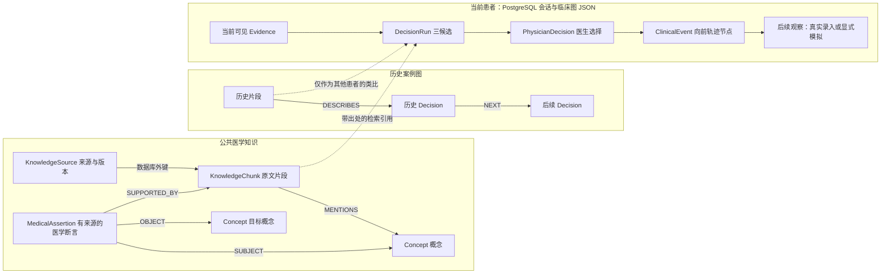

# 当前知识图谱结构与设计理由

对应代码版本：`f351b2b`。本文件说明已经提交的结构及其边界，不把计划中的能力当成已完成能力。

## 1. 总体结构：共享医学知识，独立患者时序

系统同时管理三类资料：公共医学知识、其他患者的历史轨迹、当前患者的已知证据。三者通过来源 ID 和引用连接，保持明确边界。PostgreSQL 保存正文、元数据、患者会话和事件；pgvector 保存向量；Neo4j 保存概念与关系投影。

图中来源外键和患者流程是逻辑关联；`SUBJECT / OBJECT / SUPPORTED_BY / MENTIONS / DESCRIBES / NEXT` 是现有 Neo4j 查询使用的关系。当前患者轨迹没有混入公共医学概念图。

## 2. 已实现的实体与字段

| 对象 | 关键字段 | 设计理由 |
|---|---|---|
| 来源 KnowledgeSource | corpus、title、version、citation、license、content_sha256 | 确定资料来源、版本和授权，支持发现原文变化 |
| 片段 KnowledgeChunk | source_id、document_id、text、concept_ids、hash、facets | 让引用指向可核对的原文片段，支持文档级去重与隔离 |
| 概念 Concept | id、label、kind、terminology_system/version | 跨专科共用疾病、症状、检验、药物和影像概念，避免每科重复造词表 |
| 医学断言 MedicalAssertion | relation、applicability、curator、source_excerpt、source/version/hash、facets | 把适用条件和依据附着在关系上，允许不同指南、不同人群的建议并存 |
| 当前患者 Evidence | evidence_id、available_at、observed_at、synthetic、provenance | 分开“何时发生”和“何时可被智能体知道”，避免未来信息泄漏 |
| 决策与轨迹 | recommendation、physician_decision、event_id、problem_id、parent_event_ids、owner、clock | 保留候选、医生意图、问题分支、主管归属和时间顺序 |
| 研究事件 TraceRecord | session_id、run_id、event、timestamp | 重放分诊、检索、协作、审计和模拟过程，支持逐阶段评价 |

**关键实现细节：医学关系存为一个断言节点。** 例如“某疾病在某条件下建议某检查”，不是仅保存一条不带出处的疾病—检查边，而是由断言节点连接主体、客体和原文。现有 `relation` 是断言属性，不能将所有关系名称误认为已经创建的 Neo4j 边类型。

概念类型已覆盖：疾病、症状、检查、药物、操作、照护场景、禁忌、指南、影像征象、解剖部位、病原体、组织学、分期、标志物、暴露。

医学关系已定义：HAS_PHENOTYPE、EVALUATED_BY、RECOMMENDS、RECOMMENDS_AGAINST、CONTRAINDICATED_WITH、INTERACTS_WITH、HAS_IMAGING_FINDING、LOCATED_IN、HAS_PATHOGEN、HAS_HISTOLOGY、HAS_STAGE、HAS_BIOMARKER、MODIFIES_EFFECT、DIFFERENTIAL_OF。导入断言必须具有已存储公共片段中的精确引文。

## 3. 多专科共享 schema，按任务选择证据

`KnowledgeFacets` 已定义以下维度：

- 信息性质：specialties、dimensions、modality、body_site、finding、laterality、negated、certainty。`negated=null` 表示未标注，和明确阴性分开。
- 适用条件：population、年龄范围、severity、stage、histology、biomarker、treatment_line。
- 证据属性：evidence_level、recommendation_strength、有效时间范围、annotation_method。
- 标准映射：terminology_system/version、fhir_resource、omop_domain。

| 专科 | 当前主要排序权重 | 为什么这样设计 |
|---|---|---|
| 慢阻肺 | 肺功能 1.0；氧合、急性加重各 0.9；暴露 0.7 | 优先寻找气流受限和病情变化相关资料，影像权重为 0.4 |
| 肿瘤 | 病理、分期各 1.0；标志物 0.9；治疗线次 0.8 | 同样的“肿瘤”需要结合分型、分期和治疗阶段选择知识 |
| 肺炎 | 影像 1.0；氧合、病原学、严重程度各 0.9 | 提高影像证据优先级，同时保留感染与严重程度上下文；CT 是影像模态之一 |

这些数值是当前实验超参数，尚无临床验证。任务匹配分为命中维度权重之和除以该专科全部维度权重之和。多专科共享同一份检索结果，各自重新排序，引用 ID 保持一致。

当前召回采用 FTS + BGE-M3 dense/sparse + 图谱，RRF 融合后交给 BGE reranker。最终分数为 `0.80 × 重排相关度 + 0.15 × 任务匹配 + 0.05 × 归一化 RRF`，不表示诊断概率。公共知识和历史案例在候选池中各保留配额。

**科研价值在于可验证的假设：同一语料和模型下，按任务维度选择证据是否提高候选可接受率。** 对照组应分别移除任务维度、图谱、重排序和专科路由，报告独立贡献。

## 4. 为什么使用这套结构

1. 来源断言使“为什么建议”可核查，能处理指南版本、适用条件与证据冲突。
2. 一套通用概念加专科维度，让新增专科主要通过注册表与标注扩展，而不是复制知识库。
3. 医学知识图与患者轨迹分开，使其他人的后续确诊不会成为当前患者的已知事实。
4. 医生选择与内部审计分开，既保留研究中的风险发现，也保留三个可选方案和医生自主输入。
5. 每轮保存提示词、模型、来源与轨迹，可用于回放评测和蒸馏；生成的模拟观察不能充当独立临床真值。

结构采用公开 FHIR / OMOP 的概念对齐方向，不声称复刻医渡私有 schema，也不代表已完成 FHIR 接口或 OMOP ETL。公开依据见 [架构设计文档](research-architecture-v2.md)。

## 5. 当前完成边界

已有实体合同、来源校验、专科注册表、检索链和轨迹存储；图谱知识的内容规模仍处早期。仓库种子只定义三条有来源的医学断言，不能称为覆盖三专科的大规模医学图谱。BGE 全量索引及完整性能验收尚未完成。

当前排序主要利用维度与允许关系；人群条件、否定、时效和证据等级尚未形成完整的适用性推理。自动主题词标注只是文献分类。影像目前输入报告文本，没有完成 CT 像素诊断。

下一阶段预算应优先支持来源授权、术语映射、临床标注、断言级条件匹配和独立评测，而不是单纯堆叠更多节点。

实现入口：[实体与断言](../clintraj/server/medical_graph.py)、[任务字段](../clintraj/server/knowledge_schema.py)、[专科权重](../configs/specialists.yaml)、[存储结构](../clintraj/server/db.py)、[检索排序](../clintraj/server/knowledge.py)。
